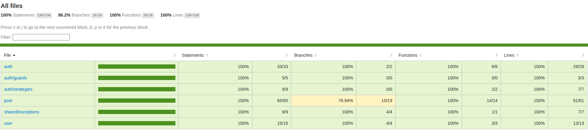

# 🚀 Linx API

API containerizada com **Docker** e **docker-compose**, documentada com **Swagger**, com **CI (GitHub Actions)**, testes automatizados em **Jest** e análise de qualidade com **SonarQube**.

---

## 📦 Tecnologias Utilizadas
- 🐳 **Docker & Docker Compose**
- ⚡ **NestJS**
- 🧪 **Jest**
- 📊 **SonarQube**
- 📖 **Swagger**
- 🐘 **PostgreSQL (Prisma ORM)**
- 🛡️ **Rate Limiting (✅ Proteção Ativa contra DDoS)**

---

## 🛠️ Como rodar o projeto

1. Copiar o arquivo de variáveis de ambiente:
   ```bash
   cp .env.example .env
   ```
   > Já existem valores de exemplo em `.env.example`.

2. Subir os containers com Docker:
   ```bash
   docker-compose --env-file .env up --build
   ```

3. Acessar a API:
   👉 [http://localhost:3000/posts](http://localhost:3000/posts)

---

## ✅ Como rodar os testes

```bash
npm run test
```

📸 Cobertura de testes:


---

## 📖 Documentação Swagger

Para acessar a documentação interativa:
👉 [http://localhost:3000/api-docs](http://localhost:3000/api-docs)

---

## 🛡️ Rate Limiting

A API possui controle de rate limiting implementado com **Redis** para prevenir abuso e garantir a estabilidade do sistema. O limite é aplicado por IP e por rota específica.

---

## 📌 Rotas da API - Auth

| Método | Rota             | Descrição              | Protegida |
|--------|------------------|------------------------|-----------|
| POST   | `/auth/login`    | Login de usuário       |           |
| POST   | `/auth/register` | Registrar usuário      |           |


---

## 📌 Rotas da API - Posts

🔒 Todas as rotas estão protegidas com autenticação **JWT**.

| Método | Rota             | Descrição              | Protegida |
|--------|------------------|------------------------|-----------|
| GET    | `/posts`         | Lista todos os posts   | ✅        |
| GET    | `/posts/:id`     | Detalhes de um post    | ✅        |
| GET    | `/posts/my`     	| Posts do usuário logado| ✅        |
| POST   | `/posts`         | Cria um novo post      | ✅        |
| PUT    | `/posts/:id`     | Atualiza um post       | ✅        |
| DELETE | `/posts/:id`     | Remove um post         | ✅        |

---

## 📂 Estrutura do Projeto (simplificada)

```
📦 src
 ┣ 📂 auth          # Autenticação e JWT
 ┣ 📂 posts         # CRUD de Posts
 ┣ 📂 shared        # Enums, Interfaces e Exceptions...
 ┣ 📂 prisma        # Configuração do Prisma ORM
 ┗ 📜 main.ts       # Arquivo inicial do projeto
```

---

👨‍💻 Desenvolvido por **Cristiano da Silva**
